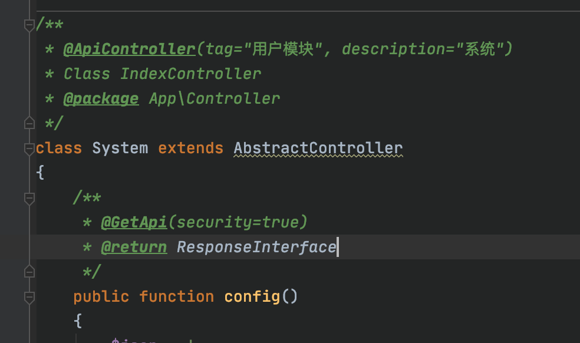
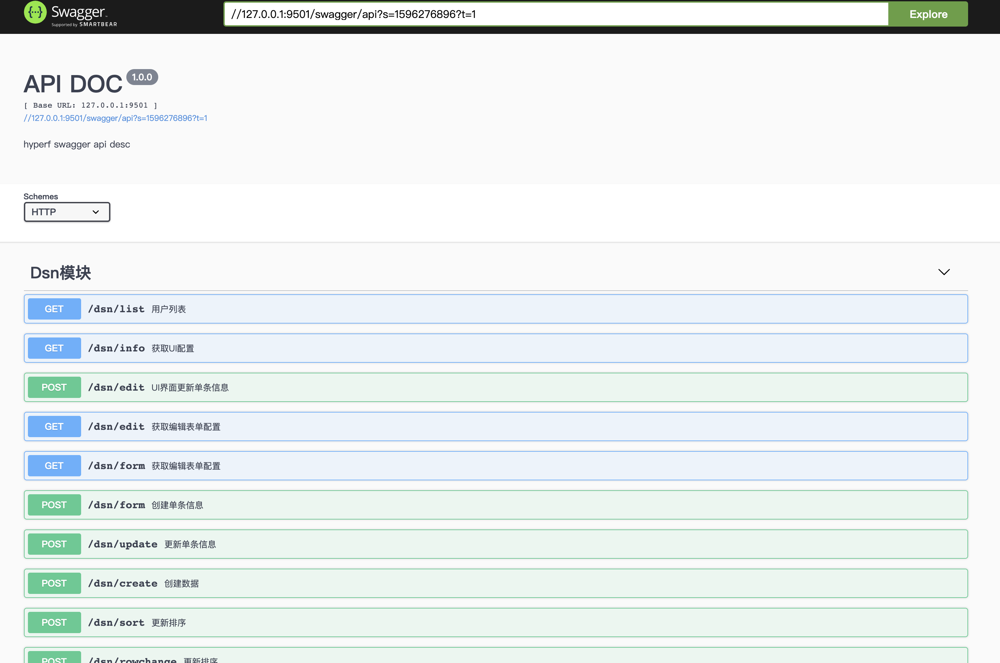

# hyperf swagger 

hyperf-swagger 注解自动生成文档，配合mzh/validate 验证器可自动根据验证规则、场景生成文档所需参数，无需手动编写doc文档


## 1、安装
```
composer require mzh/hyperf-swagger 
```
## 2、发布配置文件
```
php bin/hyperf.php vendor:publish mzh/hyperf-swagger

默开启文档web访问，如需关闭，在 config/autoload/swagger.php 将enable设为false 
```

## 3、配置dependencies
```
// config/dependencies.php  重写 DispathcerFactory 依赖
<?php
declare(strict_types=1);

return [
    'dependencies' => [
        Hyperf\HttpServer\Router\DispatcherFactory::class => Mzh\Swagger\DispathcerFactory::class
    ],
];
```

## 完成访问
### 通过以上配置后，启动项目访问
http://您的域名/swagger/index 即可直接展示

## 配置描述
```php
// config/autoload/swagger.php  swagger 基础信息
<?php
declare(strict_types=1);

return [
    'output_file' => BASE_PATH . '/public/swagger.json',
    'swagger' => '2.0',
    'enable' =>true, // 是否启用web访问
    'info' => [
        'description' => 'hyperf swagger api desc',
        'version' => '1.0.0',
        'title' => 'HYPERF API DOC',
    ],
    'host' => 'hyperf.io',
    'schemes' => ['http']
];
```

# 鸣谢
思路实现来源于 https://github.com/daodao97/apidog 本插件为改良版本